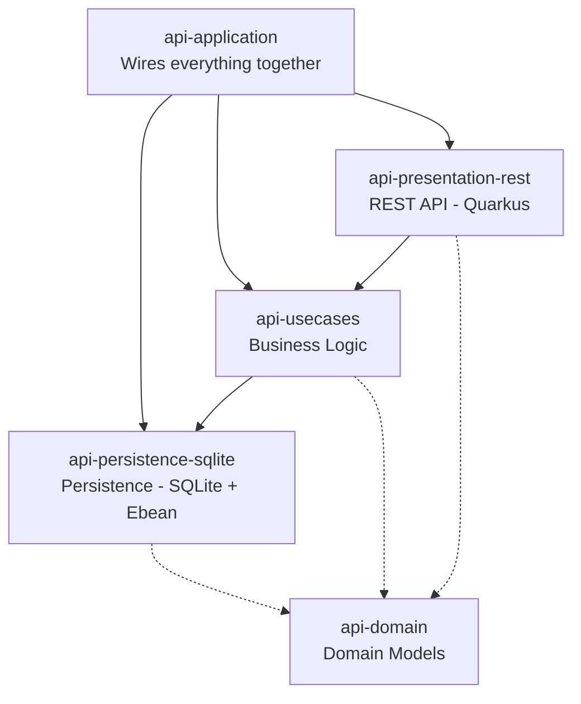

# Pinry Reborn - API server

This directory contains the API server for the project.  
It is in charge of all the business logic, to be called by clients.

## Running

To start the API locally in dev mode

```sh
./gradlew quarkusDev
```

## Architecture

The API follows the clean architecture principle, with each part in its own submodule.
- `api-domain` contains all the domain models, and is independent
- `api-persistence-sqlite` implements persistence using sqlite + ebean
- `api-usecases` implements the business logic, on top of persistence
- `api-presentation-rest` implements a JSON REST API for the business logic, using Quarkus
- `api-application` wires everything together



